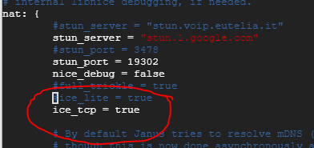

# Janus Client for Python

[](https://opensource.org/licenses/MIT) 

This is a [Janus](https://github.com/meetecho/janus-gateway) webrtc client written in Python, to be used with asyncio.

---

## Installing

```bash
pip install janus-client
```

---

## Description

### Features

:heavy_check_mark: Connect to Janus server through websocket (using [websockets](https://github.com/aaugustin/websockets))  
:heavy_check_mark: Create/destroy sessions  
:heavy_check_mark: Create/destroy plugins  
:heavy_check_mark: Handle transactions with Janus  

### In Progress

:clock3: Emit events to respective session and plugin handlers  
:clock3: Create plugin for videoroom plugin  

### Dependencies

- [websockets](https://github.com/aaugustin/websockets)

---

## Development

The package hopes to implement a general purpose client that can communicate with a Janus server. Examples like VideoRoom plugin is not part of their core features, so it's not included in the package.  
But it can still be included as a default example though. It's up for discussion.

You can refer to [video_room_plugin.py](./video_room_plugin.py) to see how a plugin handle is created.

And in [main.py](./main.py), you will be able to find references on how to use the client in general such as connecting and creating sessions.
Essence:

```python
import asyncio
import ssl
import pathlib
from video_room_plugin import JanusVideoRoomPlugin
from janus_client import JanusClient, JanusSession

ssl_context = ssl.SSLContext(ssl.PROTOCOL_TLS_CLIENT)
localhost_pem = pathlib.Path(__file__).with_name("lt_limmengkiat_name_my.crt")
ssl_context.load_verify_locations(localhost_pem)

async def main():
    # Connect to server
    client = JanusClient("wss://lt.limmengkiat.name.my/janusws/")
    await client.connect(ssl=ssl_context)
    # Create session
    session = await client.create_session(JanusSession)
    # Create plugin
    plugin_handle = await session.create_plugin_handle(JanusVideoRoomPlugin)

    participants = await plugin_handle.list_participants(1234)
    if len(participants) > 0:
        # Publishers available
        participants_data_1 = participants[0]
        participant_id = participants_data_1["id"]

        # Subscribe to publisher, will get jsep (sdp offer)
        await plugin_handle.subscribe(1234, participant_id)
        # WebRTC streaming not implemented yet
        await asyncio.sleep(5)
        # Unsubscribe from the publisher
        await plugin_handle.unsubscribe()

    # Destroy plugin
    await plugin_handle.destroy()
    # Destroy session
    await session.destroy()
    # Destroy connection
    await client.disconnect()

asyncio.run(main())
```

### Installing for development

Installing gstreamer  
<https://gstreamer.freedesktop.org/documentation/installing/on-linux.html?gi-language=python>

Installing gst python  
<http://lifestyletransfer.com/how-to-install-gstreamer-python-bindings/>

Installing webrtcbin  
<https://github.com/centricular/gstwebrtc-demos/issues/37>  
(gir1.2-gst-plugins-bad-1.0)

More bad plugins  
frei0r-plugins

### Quirks

There is a problem with GstWebRTC on my Raspbian Buster (RPI 2)  
It's complaining about ssl and then failing DTLS.  
Referring to this PR: [webrtcbin: fix DTLS when receivebin is set to DROP](https://gitlab.freedesktop.org/gstreamer/gst-plugins-bad/-/merge_requests/407)  
I believe there is a bug in the distributed GStreamer version (v1.14.4) thus I recompiled it on my RPI 2  

Recompiling GStreamer is also a non-trivial task. Since it's Linux, I'm using meson build.  
I checked out tag 1.18.3, followed steps in GStreamer documentation, and build failed.  
You can refer to this [issue](https://gitlab.freedesktop.org/gstreamer/gst-plugins-good/-/issues/839) for the reason.  
Personally I prefer building a tag release, so I patched the build with [this PR](https://gitlab.freedesktop.org/gstreamer/gst-plugins-good/-/merge_requests/875/diffs) and finally build passed.

Installing was then tedious. Actually this should have been done before compiling, but I only did it after realising Python binding for Gst can't be found.  

```bash
# Initialising build
meson build_directory
# Configuring build
meson configure -Dpython=enabled -Dgst-plugins-bad:webrtc=enabled -Dgst-plugins-base:opus=enabled -Dgst-plugins-bad:srtp=enabled build_directory/
# Build and install
ninja -C build_directory/
ninja -C build_directory/ install
```

For reference, here are some extra external libraries I installed (far from exhaustive, some might be optional):

```bash
apt-get install libgtk-3-dev libopus-dev alsa-tools alsa-utils libogg-dev libsrtp2-dev
```

After all these, then "webrtc/janus/janusvideoroom.py" from [gst-examples repo](https://gitlab.freedesktop.org/gstreamer/gst-examples/) can be run on my RPI 2.

And then another quirk, the example was still unable to setup a peer connection to my janus server at lt.limmengkiat.name.my. In the end I had to enable ice_tcp (ice_tcp=true) in janus.jcfg for it to work. I don't know why yet.

